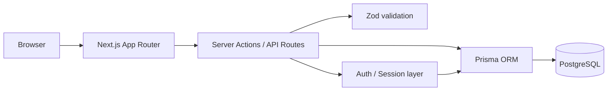

# Training

Веб-приложение для записи на тренировки и управления участием клиентов. Проект развивается как full-stack приложение на **Next.js + TypeScript + PostgreSQL** с собственной регистрацией, сессиями и подготовленной моделью ролей пользователей.

Сейчас реализована базовая инфраструктура приложения: регистрация пользователей, хранение данных в PostgreSQL, серверная валидация, безопасное хранение паролей и сессий, защищённый личный кабинет и Docker-окружение. Следующий этап — расписание тренировок, запись, подтверждение участия и очередь на освободившиеся места.

## Стек

- **Next.js 16** / App Router
- **React 19**
- **TypeScript**
- **PostgreSQL 16**
- **Prisma ORM** + migrations
- **Zod** — серверная валидация данных
- **bcryptjs** — хеширование паролей
- **Docker / Docker Compose**

## Что уже реализовано

- публичная главная страница;
- регистрация пользователя через Server Action;
- отдельный API endpoint регистрации `POST /api/auth/register`;
- проверка и нормализация номера телефона;
- проверка уникальности логина и телефона;
- хеширование паролей с bcrypt;
- роли `ADMIN` и `CLIENT`;
- хранение пользовательских сессий в PostgreSQL;
- хранение в БД только SHA-256 хеша session token;
- `HttpOnly` cookie для пользовательской сессии;
- проверка срока действия сессии и блокировки пользователя;
- защищённая страница личного кабинета;
- Prisma migrations для пользователей и сессий;
- запуск приложения и PostgreSQL через Docker Compose;
- healthcheck базы данных перед запуском приложения.

## Архитектура



Приложение и база данных запускаются отдельными контейнерами. PostgreSQL не публикуется наружу и доступен приложению внутри Docker-сети.

## Модель данных

### User

Пользователь системы содержит:

- логин и хеш пароля;
- ФИО, телефон и возраст;
- роль `ADMIN` / `CLIENT`;
- статус блокировки;
- флаг принудительной смены пароля;
- поля для будущей интеграции с VK.

### Session

Сессия связана с пользователем и содержит:

- SHA-256 хеш токена;
- дату окончания действия;
- дату создания;
- время последнего использования.

При удалении пользователя его сессии удаляются каскадно.

## Запуск через Docker

### 1. Подготовить переменные окружения

Создайте `.env` на основе примера:

```bash
cp .env.example .env
```

Пример конфигурации:

```env
POSTGRES_DB=anna_training
POSTGRES_USER=anna_training
POSTGRES_PASSWORD=replace_with_secure_password
DATABASE_URL=postgresql://anna_training:replace_with_secure_password@db:5432/anna_training?schema=public
```

Файл `.env` находится в `.gitignore` и не должен попадать в репозиторий.

### 2. Собрать и запустить контейнеры

```bash
docker compose up --build -d
```

### 3. Применить миграции Prisma

```bash
docker compose exec app npx prisma migrate deploy
```

После запуска приложение доступно по адресу:

```text
http://localhost:3100
```

Остановить проект:

```bash
docker compose down
```

Удалить контейнеры вместе с данными PostgreSQL:

```bash
docker compose down -v
```

## Структура проекта

```text
.
├── prisma/
│   ├── migrations/             # Миграции PostgreSQL
│   └── schema.prisma           # Prisma schema
├── src/app/
│   ├── api/auth/register/      # API регистрации
│   ├── dashboard/              # Личный кабинет
│   ├── lib/                    # Prisma и auth helpers
│   ├── login/                  # Страница входа
│   ├── register/               # Регистрация + Server Action
│   ├── globals.css
│   ├── layout.tsx
│   └── page.tsx                # Главная страница
├── .env.example
├── compose.yaml
├── Dockerfile
├── next.config.ts
├── package.json
└── tsconfig.json
```

## Регистрация через API

Endpoint:

```http
POST /api/auth/register
```

Пример тела запроса:

```json
{
  "fullName": "Иванова Мария Сергеевна",
  "age": 25,
  "phone": "+7 999 000-00-00",
  "login": "maria25",
  "password": "strong-password",
  "personalDataConsent": true
}
```

При успешной регистрации создаётся пользователь и открывается новая сессия.

## Безопасность

В проекте уже используются базовые меры защиты:

- пароль не хранится в открытом виде;
- session token не хранится в БД в исходном виде;
- cookie имеет флаг `HttpOnly`;
- в production cookie помечается `Secure`;
- используется `SameSite=Lax`;
- входные данные валидируются на сервере;
- логин и телефон имеют уникальные ограничения в БД;
- заблокированный пользователь не получает доступ к защищённой части приложения;
- секреты вынесены в переменные окружения.

## Текущий статус

Проект находится в активной разработке. Сейчас готов фундамент пользовательской части и базы данных.

Следующие задачи:

- [ ] завершить авторизацию по логину и паролю;
- [ ] добавить выход из аккаунта и управление сессиями;
- [ ] реализовать расписание тренировок;
- [ ] запись пользователя на тренировку;
- [ ] ограничение количества участников;
- [ ] подтверждение участия перед тренировкой;
- [ ] очередь на освободившиеся места;
- [ ] административная панель тренера;
- [ ] интеграция уведомлений VK;
- [ ] автоматизированные тесты;
- [ ] production-конфигурация Docker.

## Идея проекта

Цель — убрать ручное ведение записей на тренировки. Пользователь должен видеть доступные занятия, записываться на свободные места, подтверждать участие и автоматически попадать в очередь, если группа заполнена. Тренер получает единое место для управления расписанием, участниками и уведомлениями.
